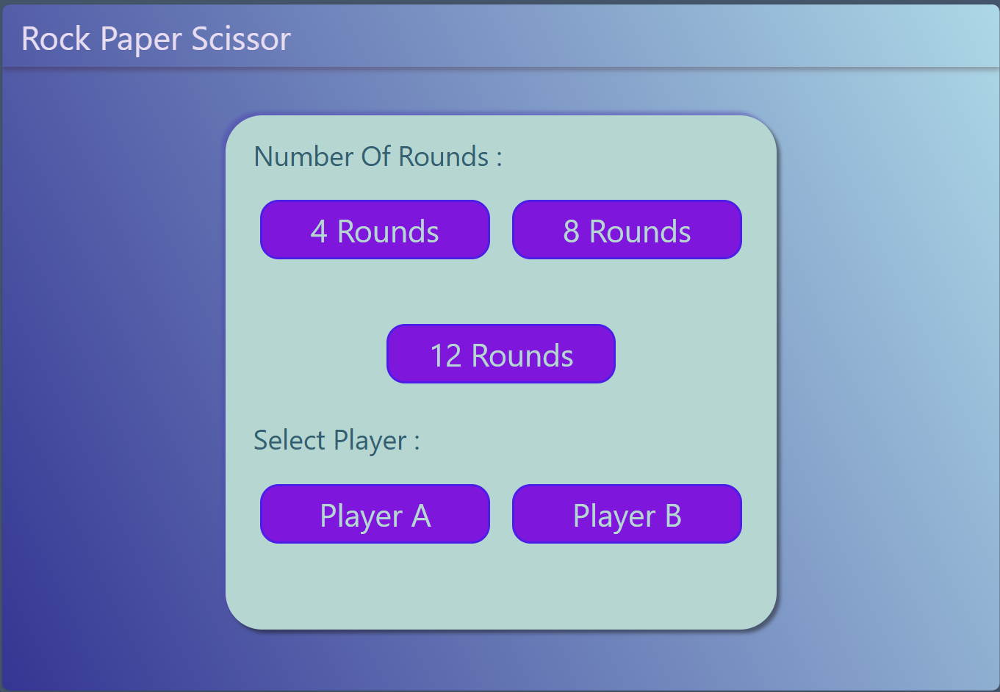
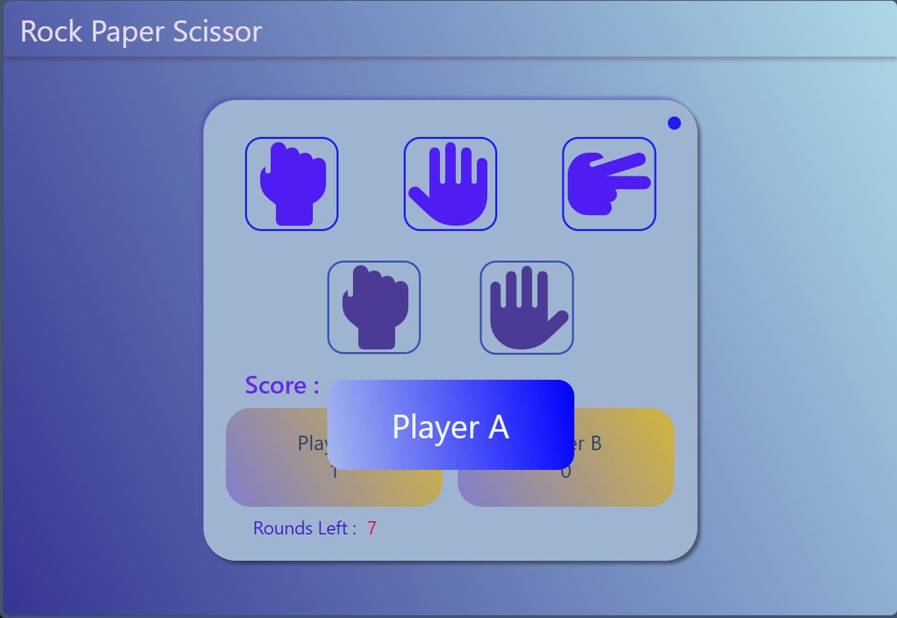
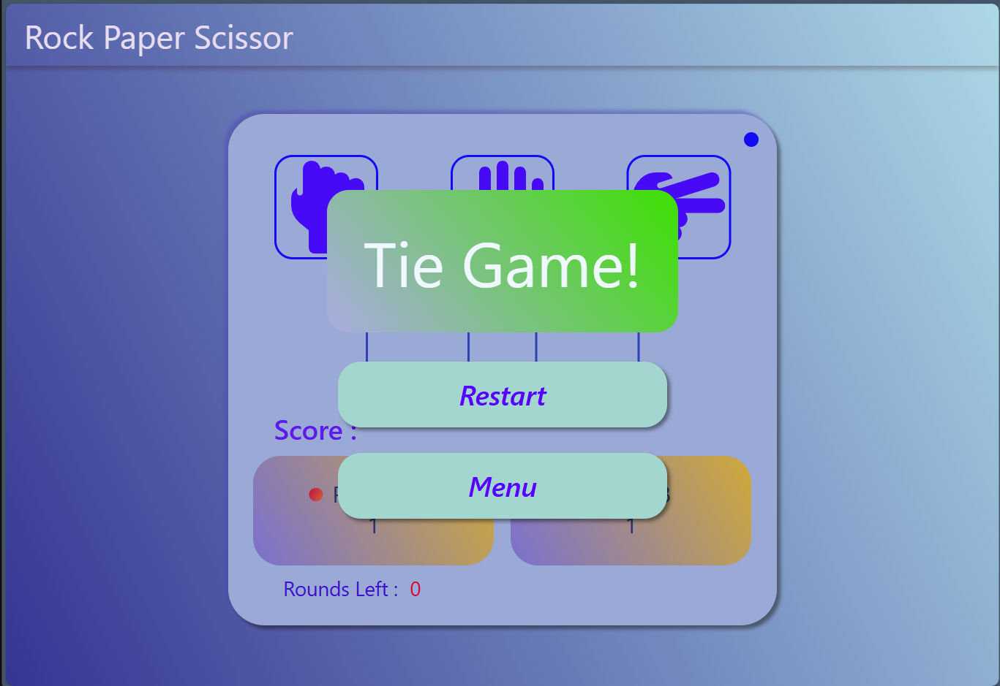

# Rock-paper-scissor

This project implements a classic Rock-Paper-Scissors game using HTML for the structure, CSS for styling, and JavaScript for interactivity and game logic.

Features:

<ul>
<li>User chooses between Rock, Paper, and Scissors using interactive buttons.</li>
<li>Computer randomly selects its choice.</li>
<li>Game logic determines the winner based on the classic rules.</li>
<li>Visual feedback displays the outcome and player/computer choices.</li>
<li>Option to play again or reset the score.</li>
</ul>

Technologies Used:

<ul>
<li>HTML: Structure and content of the web page.</li>
<li>CSS: Styles and visual elements.</li>
<li>JavaScript: Game logic, interactivity, and dynamic updates.</li>
</ul>

Mneu:

Game:

Result:

